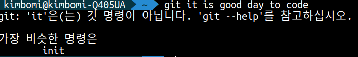
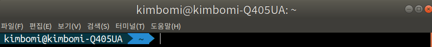
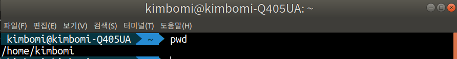
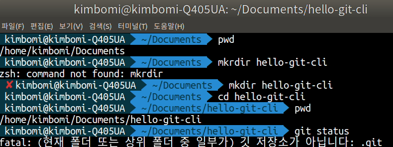

## 오늘의 할일

- [v] CLI 명령어에서 가장 기본적이고 필수적인 명령어 배우기/정리하기

## 용어 정리

- CLI(Command Line Interface) : 터미널이나 명령창에 명령어를 입력하는 방식이다.
- GUI(Graphic User Interface) : 마우스를 클릭해서 사용하는 방식이다.
- 왜 CLI를 사용할까?
  : CLI 환경에서 Git을 세세하게 제어할 수 있으며, GUI 환경보다 작업 속도가 빠르다.
- CLI 명령 실행 중 발생하는 에러 메시지를 꼼꼼하게 일기.
   
- 터미널에서 `git: 'it'은(는) 깃 명령이 아닙니다. 'git --help'를 참고하십시오. 가장 비슷한 명령은 init` 에러를 확인할 수 있다.
- 즉, 'it' 이라는 명령은 없으니 'git --help'를 한 번 확인해보라. 가장 근접한 명령은 `init`이다.
- Git Bash : CLI 프로그램

- 프롬프트(prompt) : 윗줄에 표시된 경로와 `$`기호를 프롬프트라고 부른다.
- `kimbomi` : 내 컴퓨터의 사용자 아이디
- `kimbomi-Q405UA` : 현재 컴퓨터 이름
- `~` : 현재 폴더 위치. 기본적으로 사용자의 홈 폴더에서 시작한다. 리눅스에서는 `home/kimbomi`이다. 즉, `home/kimbomi`는 `~`을 줄여서 표시한다.

## git bash의 기본 명령어

| 명령어              | 설명                                              |
| ---------------- | ----------------------------------------------- |
| pwd              | 현재 폴더의 위치 확인                                    |
| ls -a            | 현재 폴더의 파일 목록을 확인. -a 옵셥으로 숨김 파일을 확인 가능          |
| cd               | 홈 폴더로 이동. 홈 폴더는 사용자 이름과 폴더명이 같고 내 문서 폴더의 상위 폴더임 |
| cd <폴더이름>        | 특정 위치의 디렉토리로 이동                                 |
| cd ../           | 현재 폴더의 상위 폴더로 이동                                |
| mkdir <새폴더이름>    | 현재 폴더의 아래에 새로운 폴더를 만들기                          |
| echo "Hello Git" | ehco : 메아리라는 뜻. 화면에 "" 안의 문장인 "Hello Git"을 표시   |

## Git 로컬저장소 생성하기

- 리눅스에서 `Documents` 폴더에서 `hello-git-cli` 폴더에서 `git status` 명령어를 입력한다.
- 아직 `[.git]`파일이 없기 때문에 에러가 발생한다.

- `fatal: (현재 폴더 또는 상위 폴더 중 일부가) 깃 저장소가 아니다: .git`. 즉, `.git 폴더가 없다(=현재 폴더는 Git 저장소가 아니다)` 
- 정확하게는 `git status` 명령어는 `git 워킹 트리`에서만 정상적으로 수행된다.
- `git status` : Git 저장소의 상태를 확인하는 명령어
- `git status -s` : git status 명령 보다 짧게 요약해서 상태를 보여줌. 변경된 파일이 많을 때 유용.   

- `git init` 명령어를 통해서 현재 폴더의 git 저장소 생성할 수 있다. 즉, git 저장소에 `[.git]` 폴더를 생성한다.
- `ls -a` 명령어를 통해서 숨긴파일 `[.git]`을 확인할 수 있다.
- 프롬프트를 확인해보면 `~`가 아니라 `master`를 확인할 수 있다. 즉, 프롬프트 끝에 브랜치명이 보인다면 Git 작업 폴더라는 의미이다.

## Git에서 혼동하기 쉬운 용어 정리

- 워킹트리(working tree) : 워킹트리, 워킹 디렉토리, 작업 디렉토리, 작업 폴더 모두 같은 뜻. `[.git]` 폴더를 제외한 폴더를 워킹트리라고 한다.
- 로컬저장소(local repository) : `git init` 명령어로 `[.git]` 폴더가 생성된다. 이 폴더는 로컬저장소라고 부른다. 커밋, 커밋을 구성하는 객체, 스테이지가 저장된다.
- 원격저장소(remote repository) : 로컬저장소를 업로드하는 곳을 원격저장소라고 부른다. GitHub이 원격저장소다.
- Git 저장소 : Git 명령어로 관리할 수 있는 폴더 전체를 git 프로젝트 또는 git 저장소라고 부른다.

## 옵션 설정하기

- `git config` 명령어로 옵션을 확인하거나 수정할 수 있다.
- git 옵션은 3 가지가 있다.
- 시스템 옵션 : PC 전체의 사용자를 위한 옵션
- 전역 옵션 : 현재 사용자를 위한 옵셥
- 지역 옵션 : 현재 Git 저장소에만 유효한 옵션
- 우선순위 : 지역옵션 > 전역 옵션  > 시스템 옵션
- 사용자 이름 / 이메일 / 기본 에디터 등 설정할 수 있다.