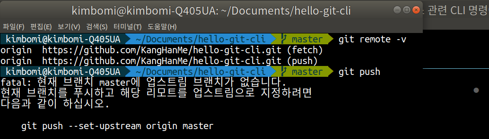
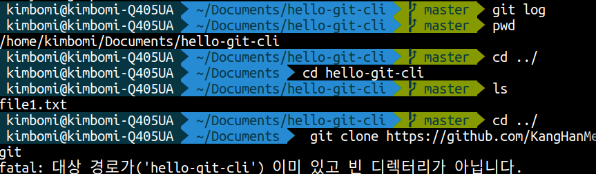

## 오늘의 할일

- [v] 원격저장소 관련 CLI 명령어 실습하기(remote, push, pull, clone)

## 원격저장소에 커밋을 올리기

- `git remote add <원격저장소 이름> <원격저장소 주소>` : 원격저장소 등록하기. 여러개 등록할 수 있지만, 보통 1개만 가진다. 보통 첫 번째 원격저장소를 origin으로 지정한다.
- `git remote -v` : 원격저장소 목록을 확인하기.
- 원격저장소 등록시, 터미널에서 원격저장소 주소 입력할 때, `shift + insert`를 사용한다. `ctrl + v` (X)
- `git push` 명령어 입력했을 때, 아래와 같은 에러가 나온다.
  
- 에러 내용은 로컬저장소의 `[master]` 브랜치와 연결된 원격저장소의 브랜치가 없어서 발생한 오류이다. 그림에서 `upstream`브랜치는 로컬저장소와 연결된 원격저장소를 말한다.
- `git push --set-upstream origin master` : 원격저장소의 `[master]` 브랜치가 로컬 저장소의 `[master]` 브랜치의 업스트림으로 지정하기
- `git log` 명령어를 통해 커밋 히스토리를 확인할 수 있는데, `[HEAD]가 [master] 브랜치를 가리키고, [origin/master] 브랜치`를 확인할 수 있다.

## 원격저장소를 로컬저장소에 복사하기

- 원격저장소를 복사할 디렉토리에 `git clone <원격저장소 주소>` 명령어를 입력한다.
- 하지만 복사할 디렉토리와 원격저장소의 프로젝트 이름이 같으면 복사가 되지 않고 에러가 발생한다.
  
- 그래서 `git clone <원격저장소 주소>`는 새로운 폴더명을 생략하면 원격저장소의 프로젝트 이름으로 폴더를 만든다.
- 새로운 폴더명을 지정하고 싶다면, `git clone <원격저장소> [새로운 폴더명]` 명령어를 이용한다.

## 원격저장소의 커밋을 로컬저장소에 반영하기

- `git pull [원격저장소 별명] [브랜치명]` 명령어를 이용한다.
- 로컬저장소 `[master] 브랜치`와 원격저장소 `[master]` 브랜치가 연결되어 있기 때문에 원격저장소 별명과 브랜치명은 생략 가능하다.그래서 `git pull` 명령을 이용할 수 있다.
