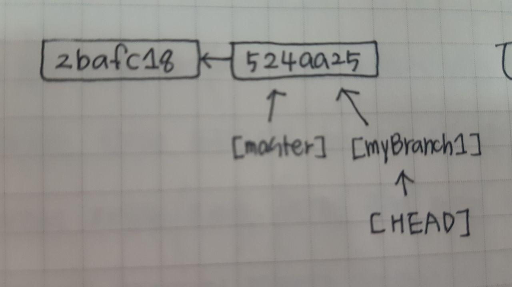
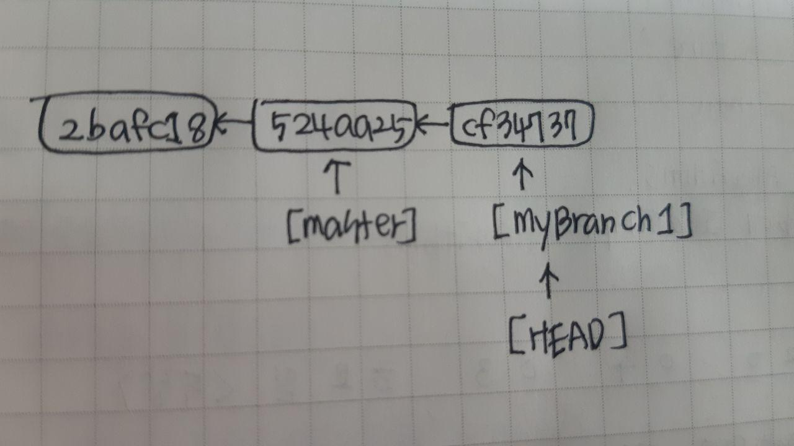
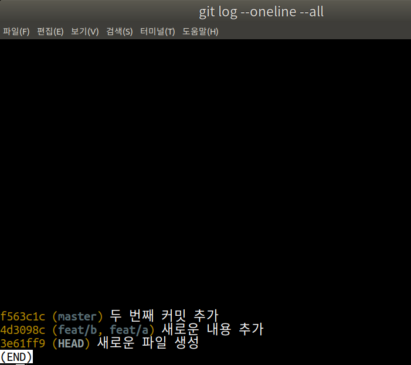

## 오늘의 할일

- [v] CLI로 브랜치 checkout 하기
- [v] CLI로 브랜치 merge 하기
- [V] CLI로 브랜치 reset 하기

## 용어 정리

- checkout : 브랜치가 가리키고 있는 커밋의 내용을 위킹트리에 반영하는 것.

## CLI를 이용한 브랜치 체크아웃 및 새 커밋 생성하기

- 현재 `hello-git-cli` 디렉토리가 워킹트리이다.
- 해당 워킹트리에서 `[master]` 브랜치와 `[myBranch1]` 브랜치가 있다. 이전에 CLI로 `[myBranch1]` 브랜치를 만들었다.
- `git checkout <브랜치이름>` 명령어를 통해 특정 브랜치로 이동한다. 즉, 특정 브랜치에 커밋의 내용을 워킹트리에 반영한다.
- `git branch` 명령어를 통해 현재 가리키고 있는 브랜치를 확인할 수 있다. 워킹트리에서 가리키는 `* myBranch`확인 할 수 있다. 즉, `HEAD`가 `myBranch1`을 가리키고 있다. 
- `git log --oneline -all` 명령어를 통해 `HEAD`와 관련된 커밋들을 확인 할 수 있다.

## 브랜치 생성 했을 때, 히스토리 그림으로 확인하기

: `[master]` 브랜치와 `[myBranch1]`브랜치가 같은 커밋을 가리킨다.

: `[myBranch1]`브랜치에서 새로운 커밋을 생성했을 때, `[myBracnh1]` 브랜치의 위치가 변경된다.

## `detached HEAD` 알아보기

- `git checkout <커밋체크섬>` 명령어를 통해서 `detached HEAD`가 가능하다. 
- 그럼 `detached HEAD`는 무엇인가? `HEAD`는 현재 작업 중인 브랜치의 최신 커밋을 가리킨다. 만약 브랜치와 `HEAD`가 다른 커밋을 가리키고 있다면, 여기서 `HEAD`는 `detached HEAD`라고 한다.   

## CLI를 이용한 빨리 감기 병합하기

- `[myBranch1]` 브랜치에서 새로운 커밋을 생성한다.
- `[myBranch1]` 브랜치는 새로운 커밋을 가리킨다.
- `[master]` 브랜치로 이동한다.
- `[myBranch1]` 브랜치와 `[master]` 브랜치를 병합한다.
- 결국 `[master]` 브랜치와 `[myBranch]` 브랜치는 같은 커밋을 가리킨다. 단순하게 `[myBranch1]` 브랜치가 `[master]`브랜치의 최신 커밋으로 이동만 하기 때문에 이를 빨리 감기 병합이라고 한다.

## reset --hard로 브랜치 되돌리기

- reset은 현재 커밋에서 예전 커밋으로 되돌릴 때 사용한다.
- reset 명령은 3가지 옵션이 있다. 특히, --hard 옵션은 예전 커밋으로 되돌리지만, 작업 폴더에도 내용에 반영된다.
- `git reset --hard <커밋체크섬>` 명령어를 이용할 때, 커밋체크섬을 입력하기가 힘들다. 그래서 `HEAD ~` 또는 `HEAD^`로 대신할 수 있다.

| reset 명령어 | 설명                                                               |
| --------- | ---------------------------------------------------------------- |
| git~<숫자>  | HEAD~은 혜드의 부모 커밋, HEAD~3는 헤드의 증조부 커밋.n 번째 위쪽 조상이라는 뜻             |
| HEAD^<숫자> | HEAD^는 헤드의 부모 커밋. n 번쨰 부모를 가리킴. 병합 커밋처럼 부모가 둘 이상의 커밋인 경우만 의미가 있음 |

## 현재 브랜치를 두 단계 이전으로 되돌리기

- `git reset --hard HEAD~2` : 현재 브랜치의 최신 커밋을 기준으로 두 커밋 이전으로 되돌린다.
- 최신 커밋을 기준으로 두 커밋을 `[master]` 브랜치가 가리킨다.
  