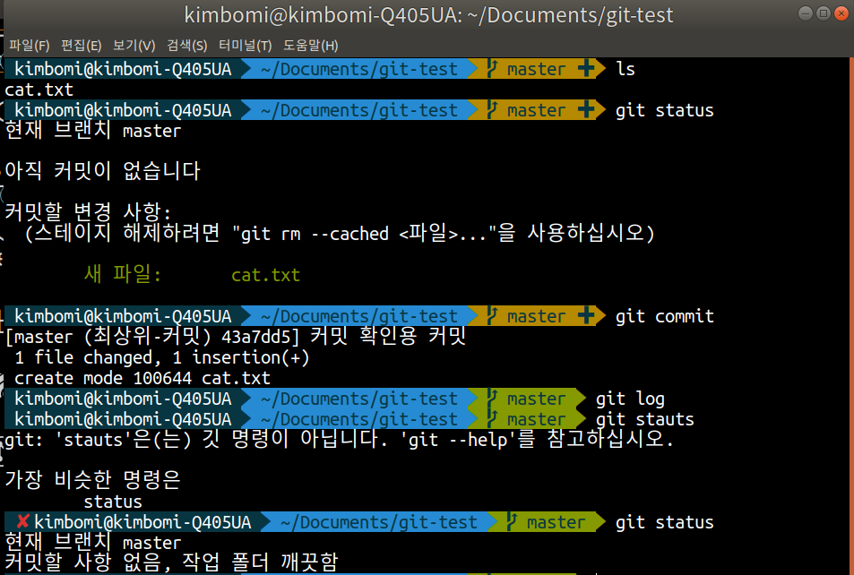
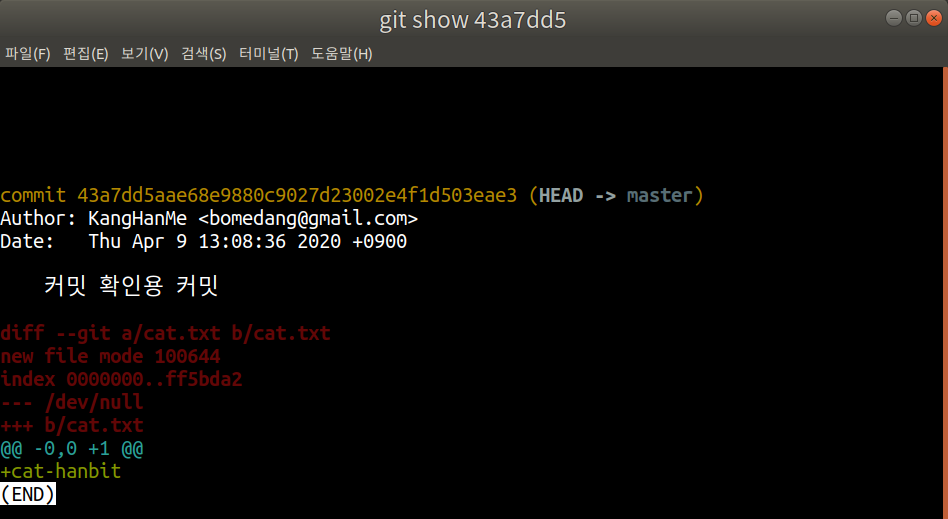
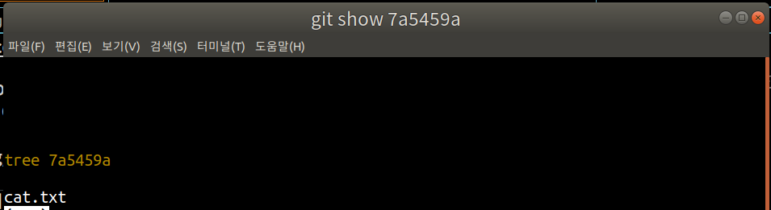
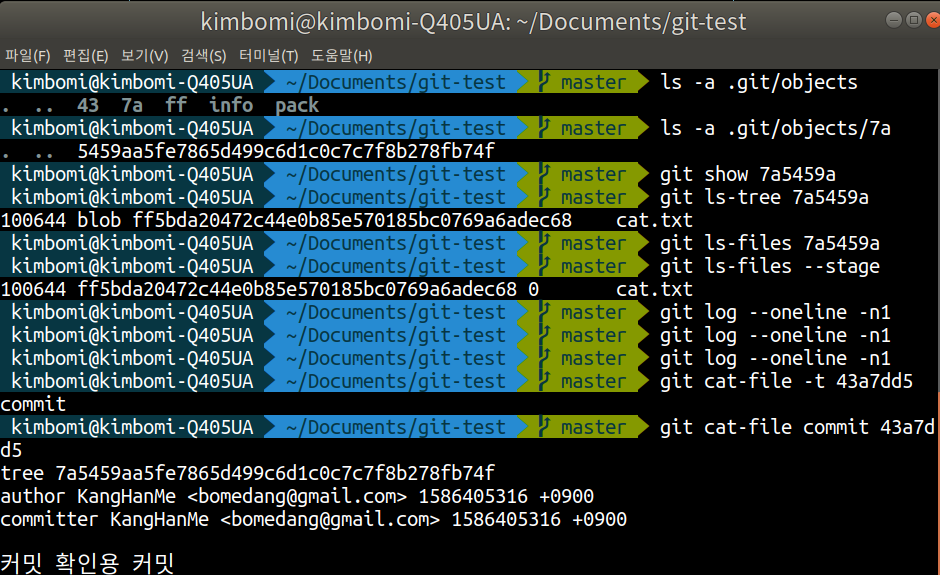
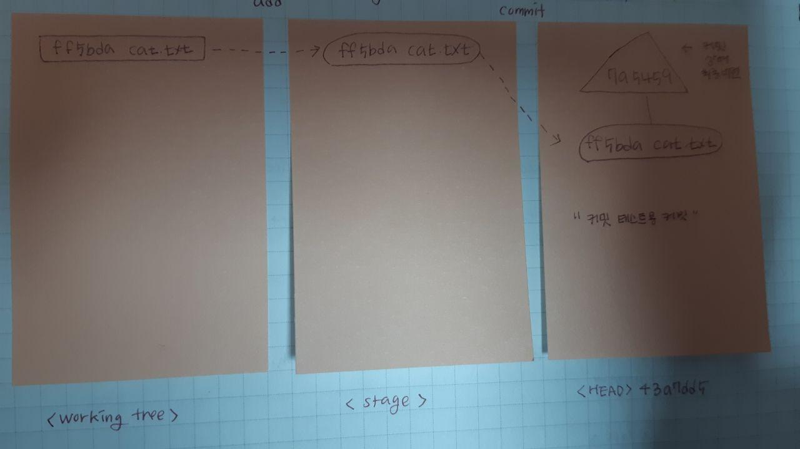

## 오늘의 할일

- [v] git commit 명령의 동작 원리 알아보기

## 커밋 하기

1 ) `git commit -m "커밋 확인용 커밋"` : 스테이지에 있는 `cat.txt`을 커밋에 파일에 추가한다.  
2 ) `git status` : 워킹트리를 확인한다.

- 커밋을 했을 때, 워킹트리, 스테이지, HEAD 커밋은 어떻게 될까?
- 커밋을 하고, 워킹트리 확인하면 위의 그림처럼 아무것도 없고 워킹트리는 깨끗하다는 메시지가 나온다.

* `git commit -m "커밋 확인용 커밋"` 명령을 통해 커밋이 생성되었다.
* `ls -a .git/objects`에서 `43`이 생긴 것을 확인할 수 있다.
* `ls -a .git/objects/43`의 커밋 객체를 확인할 수 있다.
* `git show 43a7dd5`를 통해 커밋 객체의 내용을 확인한다.

- `git ls-file --stage` : 커밋 후, 스테이지에 있는 파일을 확인하기

- `git status` 명령을 통해서 워킹트리가 깨끗하다는 의미는 워킹트리, 스테이지, HEAD 커밋의 내용이 모두 같다는 의미다!

## Git tree 객체 확인하기

1 ) `ls -a .git/objects/7a` 명령어를 통해 .git/objects의 7a폴더를 확인해보자(커밋하고나서 새롭게 생긴 폴더이다)  
2 ) `git show 7a5459a` : 7a5459a 객체를 확인하기  
  
3 ) `git ls-tree 7a5449z` : 트리 객체의 내용을 확인하기
4 ) `git ls-files --stage` : 스테이지 확인하기
5 ) `git cat-file commit 43a7dd55` : 커밋 객체를 확인하기

- 최종적으로 커밋을 하면, `.git/objects`에는 stage의 객체로 트리를 만든다
- `HEAD 커밋`에는 커밋 메시지와 트리 객체가 포함된다.
  

## 정리

: `git add`나 `git commit` 명령은 `.git/objects/`폴더에 커밋 객체가 생긴다.  
`git add` 명령은 `.git` 폴더에 `index`폴더가 생성된다. 즉, `index`폴더는 스테이지다. 그래서 stage에 올라간 파일이 있다. 그리고 `.git/objects`에 blob 타입의 커밋 객체가 생긴다.  
`git commit` 명령은 `.git/objects/` 폴더에 `tree 객체`가 생긴다. `tree 객체`는 blob 타입의 객체를 바탕으로 `tree 객체`가 생긴다. HEAD 커밋에는 최종적으로 `tree 객체`와 `커밋 메시지`가 포함된다.
