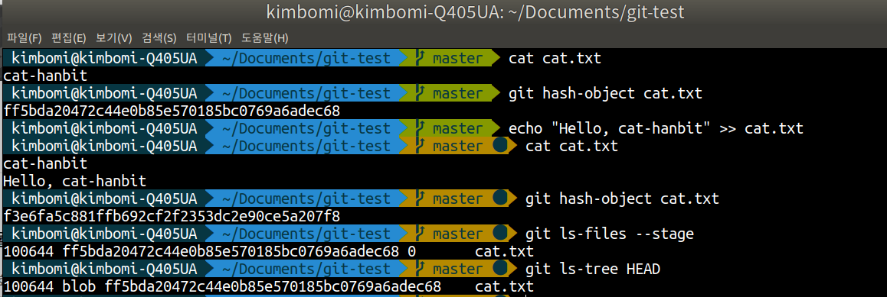
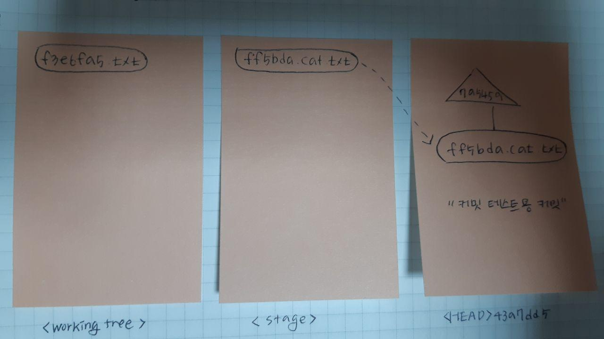
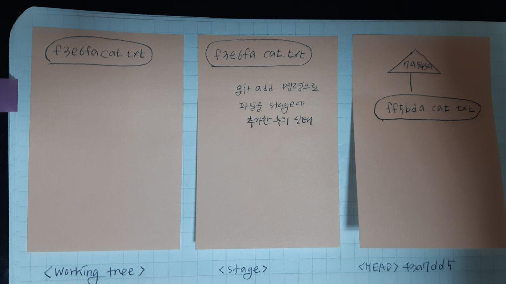
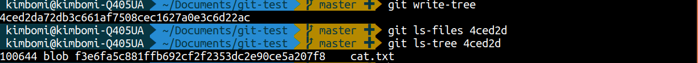
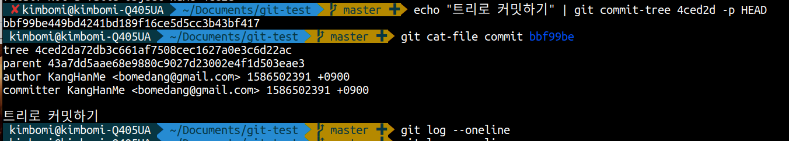
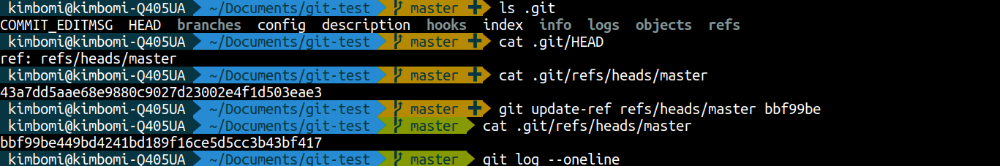
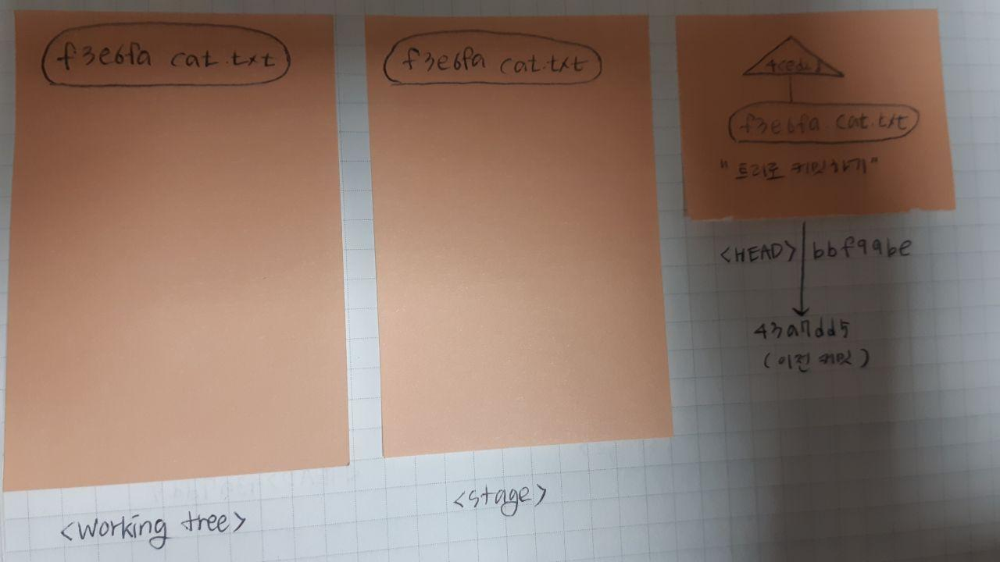

## 오늘의 할일

- [v] 수동 커밋을 통해 커밋의 내부와 동작 방식을 살펴보기

## 파일 수정하고 추가 커밋하기

1 ) `git hash-object cat.txt` : `cat.txt`(이미 커밋함) 파일의 체크섬을 확인한다  
2 ) `cat.txt`(이미 한번 커밋을 함)파일을 수정한다.  
3 ) `git hash-object cat.txt` : `cat.txt`(수정된 파일) 파일의 체크섬을 확인한다.  
4 ) 이미 커밋한 파일의 체크섬과 수정된 파일의 체크섬이 다르다는 것을 알 수 있다.  
5 ) `git ls-files --stage` : 스테이지의 파일을 확인해본다.  
6 ) 이미 커밋한 파일의 체크섬과 스텡이지의 파일의 체크섬이 같음을 알 수 있다. 수정된 파일은 아직 스테이지에 올라가지 않았기 때문이다.  
7 ) `git ls-tree HEAAD` : HEAD 커밋의 내용을 확인한다. 이미 커밋한 파일의 체크섬이랑 같음을 알 수 있다.  
즉, 커밋한 `cat.txt`의 변경 사항이 있다면, 아직 스테이지에 올리지 않았기 때문에 워킹트리의 체크섬만 다르다는 것을 알 수 있다. 추가적으로 `git status` 명령을 통해 `cat.txt`의 파일 상태는 `modified`이다. 즉, 워킹트리의 내용과 스테이지 내용이 다른 파일을 말한다.

8 ) `git add cat.txt` : 변경 사항이 있는 `cat.txt`을 인덱스(스테이지)에 추가한다.  
9 ) `git ls-files --stage` : 스테이지의 파일을 확인한다.
10 ) 워킹트리와 스테이지의 파일의 커밋 체크섬이 같다.

11 ) `git commit -m "커밋에 대한 설명" : 커밋을 했을 때,`.git/objects`에 트리객체가 생긴다. 여기서 수동으로 트리객체를 만들어서 커밋을 해보자.

12 )`git write tree`: 트리 객체를 만든다.

13 )`git ls-tree 4ced2d`: 생성된 트리 객체를 확인한다. 스테이지의 체크섬이 같음을 확인할 수 있다.

14 )`git commit-tree 4ced2d -p HEAD`: 트리 객체를 직접 커밋할 수 있다.`-p`옵션은 부모 커밋을 지정해주는 것이다. 즉,`-p HEAD`는 부모 커밋이 HEAD로 지정해주는 것이다. 그리고`echo "트리로 커밋하기"`는 커밋 메시지를 지정해주는 것이다.

15 )`git cat-file commit bbf99be`: 생성된 커밋을 확인하기.

16 )`git log --oneline`: 생성한 커밋의 히스토리를 확인 할 수 없다. 그 이유는`HEAD`가 생성한 커밋으로 갱신되지 않았기 때문이다. 보통`git commit`명령어를 작성할 경우, 커밋이 생성되고, 생성된 커밋을 HEAD가 가리킨다.

17 ) HEAD 업데이트 해보자.

18 )`.git`폴더에`HEAD`라는 파일을 확인한다.`HEAD`가 어떤 커밋을 가리키고 있는지 알 수 있다. 확인 결과, 생성된 커밋을 가리키는 것이 아니라 이전 커밋을 가리키고 있다.

19 )`git update-ref refs/heads/ bbf99be`명령을 통해`HEAD`를 업데이트 한다. 15 )`git log --online`:`HEAD`가 최신 커밋을 가리키고 있다.

- 아래의 그림은 파일의 상태가 `modifed`일 경우, 커밋을 했을 때의 워킹트리, 스테이지, HEAD 커밋의 상태이다.

## 정리

- `git add` : 워킹트리의 내용을 스테이지에 반영하는 것.
- `git commit` : 스테이지 내용을 바탕으로 트리 객체를 만든다. 해당 트리 객체를 기반으로 기존 HEAD 커밋을 부모하는 새로운 커밋을 만든다. 새로운 커밋은 HEAD가 가리킨다.
