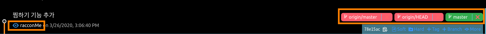
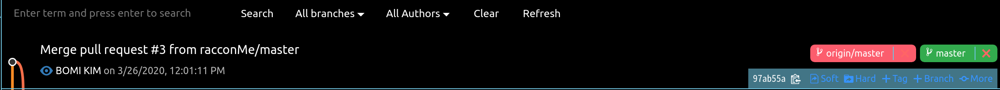
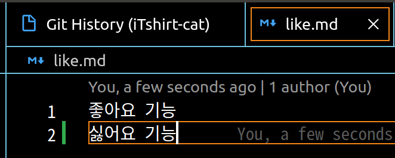
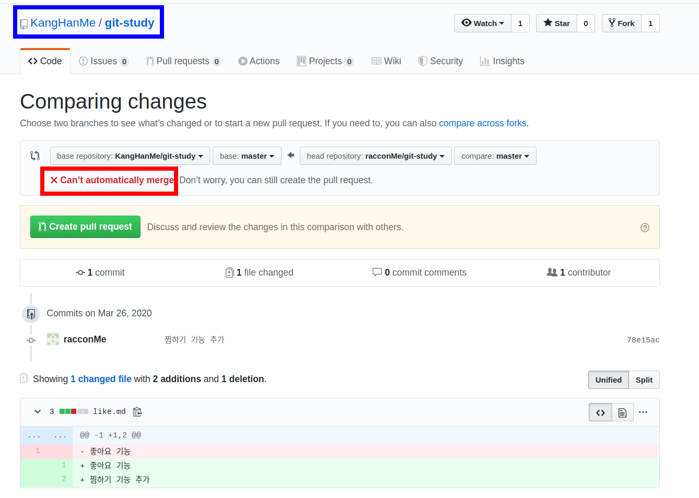
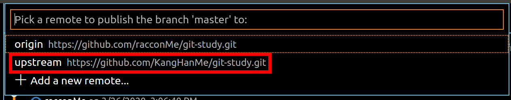
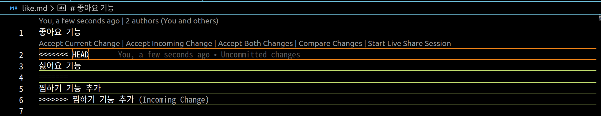
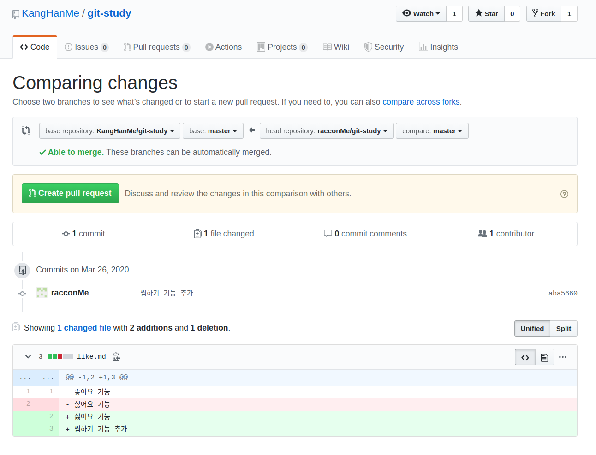
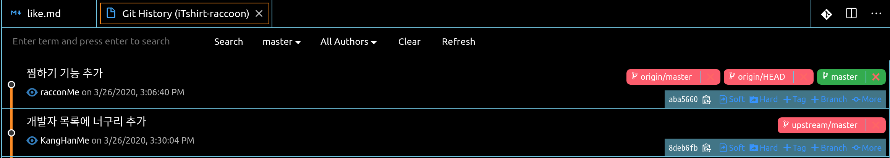

## 오늘의 할일

-[v] 묵은 커밋을 새 커밋으로 이력 조작하기

## 용어 정리
- 리베이스(rebase) : 병합할 때, 병합 커밋없이 커밋의 베이스를 다른 베이스로 변경하는 것.   
- 리베이스 왜 사용하는 걸까?
  : 병합 커밋이 생기지 않고 깔끔하게 커밋의 히스토리를 조작할 수 있다.

## 묵은 커밋을 새 커밋으로 이력 조작하는 실습하기

- 전제 상황 : 원본저장소와 개발자 너구리의 원격저장소가 서로 같은 코드를 고쳐서 출동나는 상황을 만들어 보기   
- 소스트리에서는 쉽게 계정을 전환할 수 있다.
- Git History에서는 계정 전환 방법을 찾지 못했다. 결국 찾아낸 해결 방법으로 `git config --global user.email <개발자 너구리의 깃헙 이메일 주소>`와 `git config --global user.name <개발자 너구리의 깃헙 이름>`을 변경해준다.   

1 ) 개발자 너구리 계정으로 이동하기   
- 개발자 너구리 계정에서 `iTshirt-raccon`폴더를 열어서 `like.md`에 새로운 텍스트를 입력한다. 
- 변경사항이 담긴 `like.md`을 커밋에 추가할 파일 선택 및 커밋을 하고, 개발자 너구리의 원격저장소에 올린다.

- 아래의 그림과 같이 `찜하기 기능 추가`커밋은 확인할 수 없다. 이전에 이미 개발자 너구리가 `좋아요 기능`을 원본저장소로 풀 리퀘스트를 보내어 승인 후, 원본저장소에도 반영되었다. 추가적으로 로컬저장소에 최신 코드를 반영한다. 즉, `git pull origin master` 명령어를 실행하면 된다.


3 ) 커밋 사이에서 충돌 나는 상황을 만들기   
3 - 1 ) 원본저장소의 소유자 계정으로 이동하기   
-`iTshirt-cat`에서 `like.md` 파일을 열어 새로운 텍스트를 추가한다.
   
-`like.md`파일을 커밋에 추가할 파일로 선택 및 커밋 후, 원본저장소에 올린다.   
-`README.txt`에 새로운 텍스틀 추가해서 커밋을 만들고, 원본저장소에 올린다.
- 총 2개의 커밋이 앞서가 있다.   
 
3 - 2 ) 개발자 너구리 계정에서 풀 리퀘스트하기
- 이미 원본저장소에 총 2개의 커밋이 반영되어 있다. 현재 개발자 너구리 원격저장소는 원본저장소의 변경사항(2개의 커밋)이 반영되어 있지 않다. 개발자 너구리가 풀 리퀘스를 할 경우, 충돌이 발생한다. 둘 다 `like.md`의 소스코드를 변경했기 때문이다.


4 ) 충돌 만들기 성공   

5 ) 여러 원격저장소 히스토리 한 눈에 보기
- 앞서 두 개발자 사이에 충돌이 난 이유는 무엇일까? 개발자 너구리가 원본저장소의 변경사항을 알았더라면 충돌을 막을 수 있지 않았을까? 변경사항을 알고 다시 너구리의 원격저장소의 코드 최신화를 하고, 변경 사항을 반영하면 되지 않을까? 하지만 `git pull`은 원본저장소의 변경사항을 개발자 너구리의 로컬저장소에 반영된다. 너구리의 로컬저장소 업데이트가 되지 않고, 개발자 너구리 입장에서 단순히 원본저장소의 변경사항만 알고 있다면 좋지 않을까? 해결 방법으로 `git fetch <원본저장소 별명> <브랜치명>`으로 원본저장소의 이력을 업데이트한다. 즉, 개발자 너구리의 코드에는 업데이트 되지 않는다.    
- 먼저, 개발자 너구리의 로컬저장소에 원본저장소를 추가하면 된다. 즉, 개발자 너구리의 로컬저장소는 너구리의 원격저장소와 원본저장소를 바라보게 된다. 총 2개의 원격저장소가 추가된다.    
- 소스트리나 Git History에서 쉽게 원격저장소를 추가할 수 있다. 아래의 그림은 Git History에서 추가된 원격저장소를 확인할 수 있다.  

- CLI 환경에서도 쉽게 원격저장소를 추가할 수 있다.   
```sh
$ git remote add upstream <원본저장소의 주소>
```
- `git remote -v`명령어를 이용해서 추가된 원격저장소를 확인할 수 있다. 이미 `origin`이라는 별명으로 원격저장소가 생성되어 있다. 별명은 중복될 수는 없다. 보통 원본저장소를 지칭하는 관용적 별명이다.
- 다음으로, `git fetch upstream master`로 `upstream`인 원본저장소의 이력을 업데이트한다.   

6 ) 묵은 커밋을 방금 한 커밋처럼 조작하기    
- 상황 설명 : 개발자 너구리가 만든 `찜하기 추가` 기능는 예전 코드 베이스 기점으로 추가 했기 때문에 원본저장소의 최신 코드와 충돌이 일어날 가능성이 있다
- 3 ) 번에서 충돌을 만들었다. [upstream/master] 브랜치와 너구리의 [master] 브랜치 병합할 경우, 충돌이 발생한다.
- 병합 방법 1 ) 너구리의 [master] 브랜치에 [upstream/master] 브랜치를 병합한다. 병합 커밋이 생긴다. 물론 충돌이 발생했다면, 충돌 해결하고 병합 커밋이 생긴다.   
병합 방법 1 예시 이미지 )   
    
베이스 커밋 `C2`에서 `C4`와 `C3`분기가 나눠진다. `C5`가 병합 커밋이다.
- 병합 방법 2 ) 커밋의 베이스를 떼서 다른 곳에 붙인다 : 리베이스(rebase)    
   
베이스 커밋 `C2`에서 `C4`와 `C3`분기가 나눠진다. 병합 커밋을 만들 필요 없이 리베이스를 통해 `C4'`처럼 붙인다.   

6 - 1 ) 커밋의 베이스를 기준으로 리베이스하기   
- [upstream/master] 브랜치의 최신 커밋에서 [+more] - `Rebase current branch onto this (커밋아이디 7자리)commit`   
6 - 1 - 1 ) 충돌 해결하기   
   
- `Accept Both Changes`클릭
- 충돌을 해결한 파일을 커밋에 추가할 파일로 지정하고 커밋을 한다.   
- `git rebase --continue`
6 - 1 - 2 ) 로컬저장소의 이력을 원격저장소에 올리기
- 리베이스틑 히스토리를 강제로 조작하기 때문에 다른 개발자가 이 스토리를 보고 있다면 코드가 꼬일 수 있다. 그래서 혼자 사용하는 브랜치에서만 원격저장소에 올린다. 일반 푸시가 아니라 `강제 푸시`를 이용한다.
- 소스트리에서는 `강제 푸시` 옵션을 줄 수 있다.
- CLI 환경에서는 `git push origin master --force-with-lease`명령어로 원격저장소에 리베이스한 커밋도 올릴 수 있다.

7 ) 원본저장소인 [upstrem/origin] 브랜치에 개발자 너구리 원격저장소를 병합하기
7 - 1 ) 개발자 너구리 계정에서 `Pull request`하기
- 

8 ) 최종 히스토리 확인하기
   
히스토리에서 병합커밋없이 깔끔하게 병합된 것을 확인할 수 있다.

## 추가 정보
- git pull vs git fetch
- 아래의 사이트에 `git pull`과 `git fetch`의 차이점을 보여주는 그림을 참고하자. 아주 쉽게 이해가 된다. 
https://www.atlassian.com/git/tutorials/syncing/git-pull