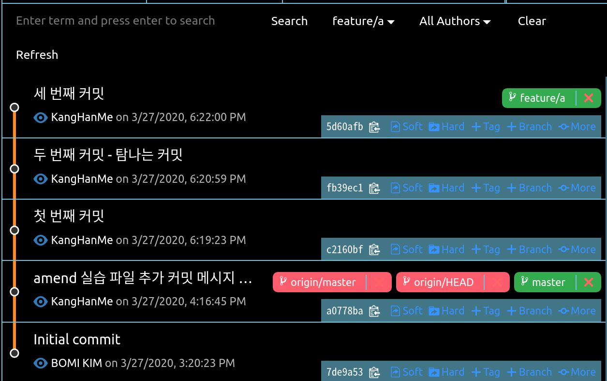
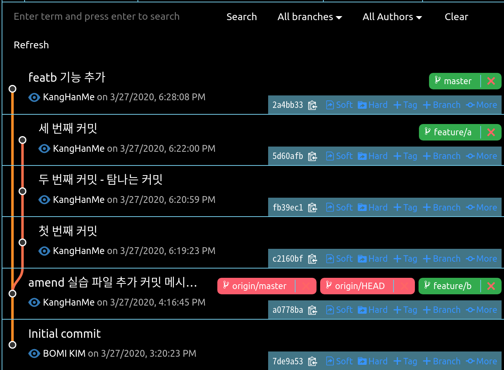
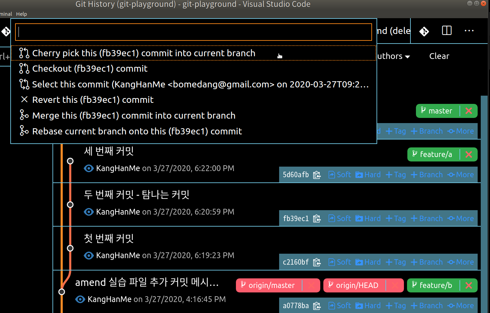
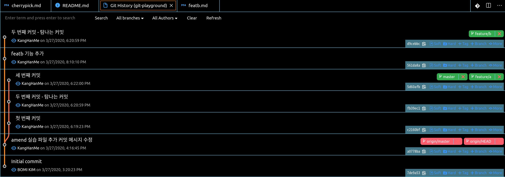

## 오늘의 할일

- [v] 원하는 커밋만 떼서 현재 브랜치에 붙이기

## 용어 정리
- git cherry-pick(체리픽): 다른 브랜치에 있는 커밋을 현재 브랜치에 반영하는 것

## 다른 브랜치의 커밋 하나만 내 브랜치에 병합 실습하기

1 ) 브랜치 만들기   

- 실습을 위해 `[master]`브랜치를 기준으로 `[feature/a]` 브랜치와 `[feature/b]`브랜치를 생성한다.
- `feature/a' 브랜치에 커밋 3개를 연달아서 추가한다.

- `[master]`브랜치로 이동한다.
- `[feature/b]` 브랜치 생성한다.
- `[feature/b]` 브랜치에 커밋 1개를 추가한다.
   

2 ) 다른 브랜치에 있는 커밋을 현재 브랜치에 반영하기  
- `[feature/a]` 브랜치에서 `두 번째 커밋 - 탐나는 커밋`만을 가져와서 `[feature/b]`브랜치에 반영하기   
- 만약에 `[feature/a]`브랜치와 `[feature/b]` 브랜치를 병합하게 되면, `[feature/b]` 브랜치의 모든 커밋들이 `[featrue/b]` 브랜치에 반영된다.
- 하지만 `git cherry-pick`은 하나의 커밋을 선택해 현재 브랜치에 반영할 수 있는 장점이 있다.   
- 먼저 `[feature/b]`브랜치에서 `두 번째 커밋 - 탐나는 커밋`커밋에서 `[+ more]` - `cherry pick this(커밋아이디 7자리) commit into current branch` 통해 `[feature/b]`브랜치에 `두 번째 커밋 - 탐나는 커밋`을 반영한다.
   
- 아래의 그림에서 `[featrue/b]`브랜치에 `두 번째 커밋 - 탐나는 커밋` 커밋을 확인할 수 있다.   
   
- `[feature/a]` 브랜치의 `두 번째 커밋 - 탐나는 커밋` 커밋 아이디는 `fb39ec1`이고, `[feature/b]` 브랜치의 `두 번째 커밋 - 탐나는 커밋` 커밋 아이디는 `d9cebbc`이다. 즉, 커밋이 같아 보이지만 엄연히 서로 다른 커밋 아이디를 확인해보면 다른 커밋이다.